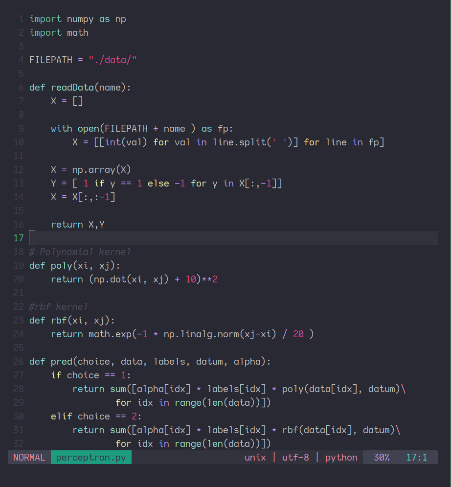
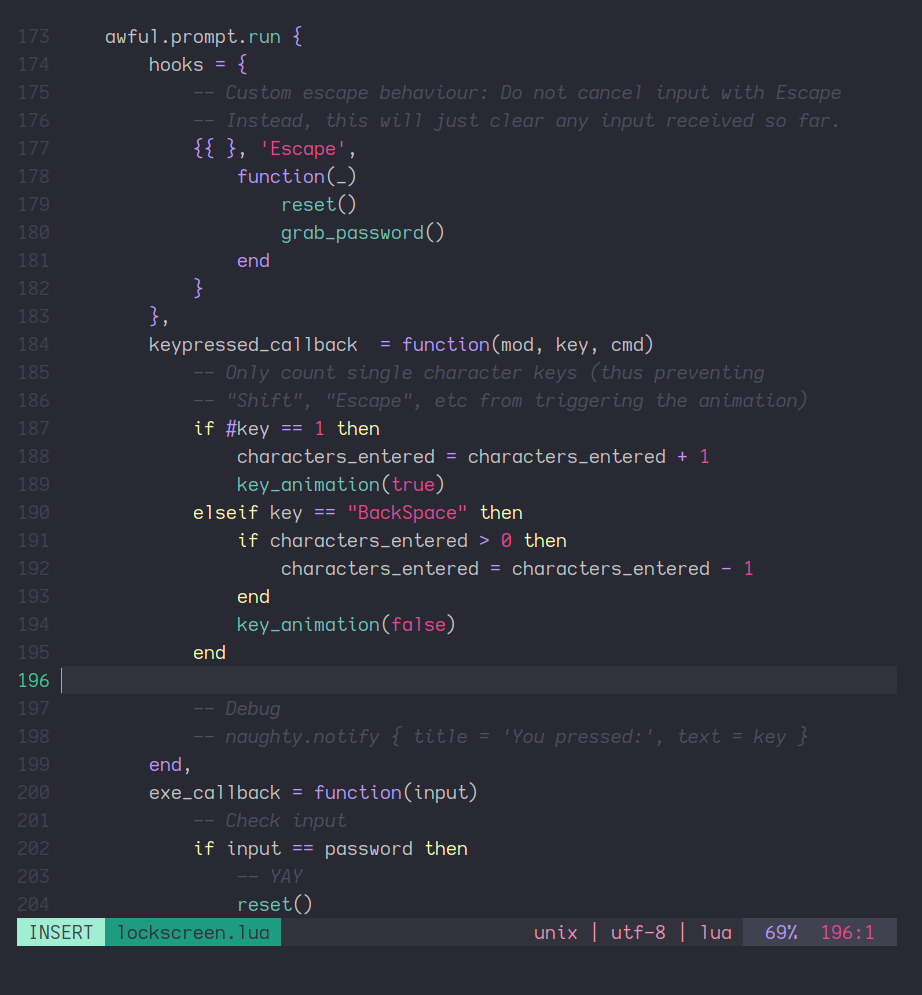
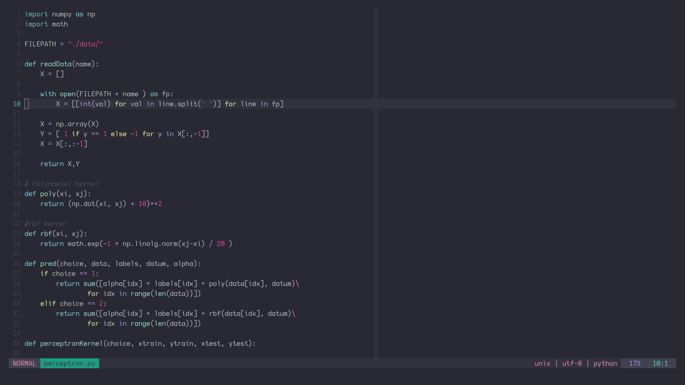

# Skyfall.Vim

Skyfall is a minimal balanced dark colorscheme for vim that's easy on the eyes.
The theme uses low contrast colors and provides good readability while not being harsh on
the eyes.

# Installation

This scheme uses terminal colors. The color settings for the terminals are present in
`terminal-colors/`. Currently supported terminals include Termite, Gnome, Iterm2, Konsole
and any terminal that can read from `.Xresources` (Urxvt, Kitty etc) are all supported. 
Clone this repo first and use the appropriate file inside `terminal-colors`.

- _Gnome:_ Run `sh terminal-colors/skyfall-gnome.sh`
- _Iterm2:_ Use the `terminal-colors/skyfall.itermcolors`
- _Termite:_ Copy the contents of `terminal-colors/termite` into your Termite config.
- _Konsole:_ Copy the contents of `terminal-colors/skyfall-konsole` into your config.
- _Xresources:_ For terminals that uses .X copy the contents of `terminal-colors/Xresources`
into your corresponding Xresources file.
- _Sublime Text:_ Use the xml file to configure the colors 

After setting the correct terminal colors install the theme by running and set your
colorscheme using.
```viml
<Package Manager> 'rishikanthc/skyfall-vim'


set t_Co=16
syntax enable
colorscheme skyfall
```

# Screenshot






# ToDo
- improve diff colors
- improve git colors
- improve spell colors
- Add support for NerdTree and other popular plugins

[1]: https://github.com/arcticicestudio/nord-vim

# Note
This is still work in progress. Bear with me for any rough edges and feel free to contact me for any issues you face.
