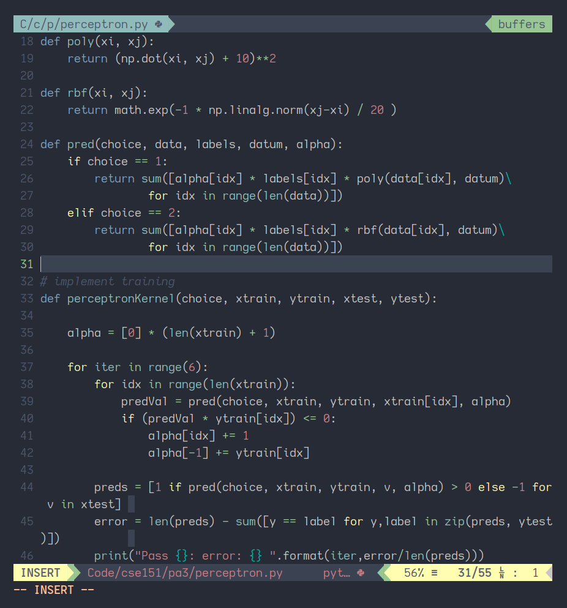

# Skyfall.Vim

Skyfall is a balanced colorscheme that's easy on the eyes, inspired by [Nord][1].
The theme uses low contrast colors and provides good readability while not being harsh on
the eyes.

# Instructions

The colors of your terminal need to be configured for this theme to work correctly.
If you are using Termite copy the contents of the file `terminal-colors/termite` into
your termite config file. For `.Xresources` copy the contents of `terminal-colors/Xresources`
into your corresponding file. For all other terminals(Kitty, Konsole etc) copy the colors
into your terminal config. I'll try to work on adding support for other terminals.

Install the terminal using your package manager `<Package manager> 'rishikanthc/skyfall'`
and set your colorscheme. The airline theme is set automatically.
```viml
set t_Co=16
syntax enable
colorscheme skyfall
```

# Screenshot



# ToDo
- improve diff colors
- improve git colors
- improve spell colors
- Add support for NerdTree and other popular plugins

[1]: https://github.com/arcticicestudio/nord-vim
